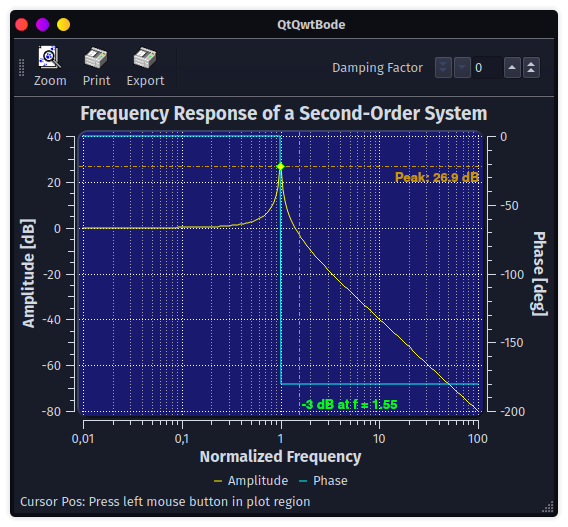

# QtQwt

[](https://github.com/ZIMO-Elektronik/QtQwt/actions/workflows/build.yml)


CMake wrapper for [Qwt](https://qwt.sourceforge.io/).

<details>
  <summary>Table of contents</summary>
  <ol>
    <li><a href="#getting-started">Getting started</a></li>
      <ul>
        <li><a href="#prerequisites">Prerequisites</a></li>
        <li><a href="#installation">Installation</a></li>
        <li><a href="#build">Build</a></li>
      </ul>
  </ol>
</details>

## Getting started
### Prerequisites
- C++17 compatible compiler
- [CMake](https://cmake.org/) ( >= 3.25 )

### Installation
This library is meant to be consumed with CMake.

```cmake
# Either by including it with CPM
cpmaddpackage("gh:ZIMO-Elektronik/QtQwt@6.2.0")

# or the FetchContent module
FetchContent_Declare(
  QtQwt
  GIT_REPOSITORY https://github.com/ZIMO-Elektronik/QtQwt
  GIT_TAG v6.2.0)

target_link_libraries(YourTarget PRIVATE Qt::Qwt)
```

### Build
If the build is running as a top-level CMake project then a small example will be generated.
```sh
cmake -Bbuild
cmake --build build --target QtQwtBode
```

